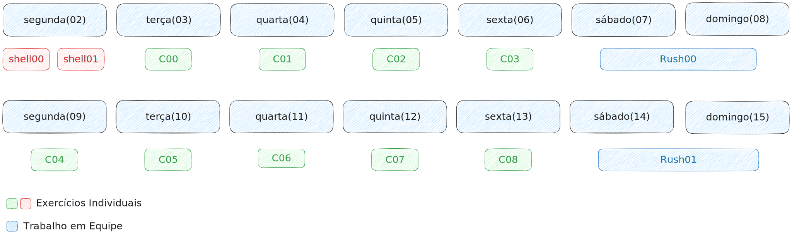

# Como vai funcionar o Mini Bootcamp 42?

O Mini Bootcamp 42 será um `bootcamp de programação de duas semanas` em que os
participantes seram imersos na metodologia da École 42. Ao longo desse período
serão dadas listas de exercícios para que os participantes possam solucionar em
colaboração, além dos `rushes`, os "trabalhos em equipe" nos finais de semana.

Para participar **NÃO** é necessário nenhum conhecimento em programação, apenas
disposição para resolver problemas e colaborar com os outros participantes.

O bootcamp não tem horário específico, porém, o laboratório com os computadores
estará disponível das 14h às 18h nos dias do evento, exceto nos finais de semana,
os participantes poderam estar nos laboratórios durante todo esse período. O
horário é livre, você pode ir e sair quando quiser.

## O que vou aprender no bootcamp?

O principal objetivo do bootcamp é incentivar a colaboração e a habilidade de
resolver problemas, para isso utilizaremos listas de problemas para serem
solucionados utilizando a linguagem `C` ou `Shell`.

Além disso, outras habilidades serão trabalhadas ao longo do bootcamp: Utilização
de `Git` e `Github`, `Linux (linha de comando)`, `editores de código`,
`lógica de programação` e outras.

## Cronograma

A cada dia do bootcamp serão liberadas listas diferentes para os participantes,
porém, os participantes só poderam avançar para outra lista após finalizar a
lista anterior com certo aproveitamento.

As listas serão liberadas de acordo com o calendário abaixo:

Ao finalizar uma lista o participante deve submeter suas soluções para a
[correção](./correction.md). Se o participante passar na correção ele pode
avançar para a lista seguinte.

Nos finais de semana ocorreram os [rushes](./rushes.md), uma lista de exercícios
mais elaborados que devem ser solucionados em equipes de 3 pessoas que serão
sorteadas na sexta-feira anterior.

## O que vou ganhar com o bootcamp?

O bootcamp é uma iniciativa de alunos de programação que acreditam no poder dessa
metodologia inovadora. É uma forma de tentar contribuir no ensino de programação
"do jeito certo" e de se divertir enquanto faz isso.

O projeto não tem patrocinadores nem nenhuma forma de arrecadar renda, então é
uma "experiência entre amigos", uma forma de estudar programação em comunidade
ou um "grupo de estudos", como quiser.

Porém, aqueles que se destacarem nos rankings teram uma premiação, uma forma de
gamificar o bootcamp.
